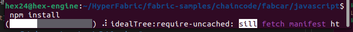
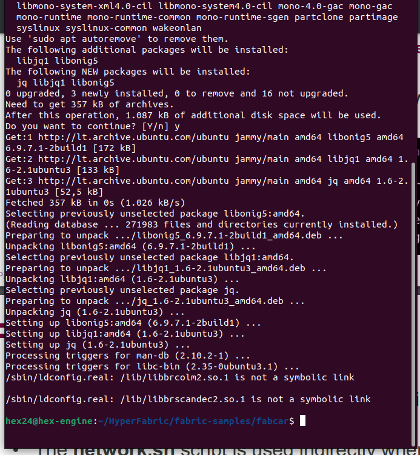

# Checking git, curl, npm, node versions: #

Visos versijos pas mane yra parodomos todel nereikia installiuot nieko.


# Installing docker / docker-compose: #

Dockeri as jau turejau pries tai įdiegęs.


# Installing Fabric script: #

Paruošiu fabric scriptą.


# Executing Fabric script: #

Duodu CHMOD perms fabric scriptui, executing


# Setting up Fabric smart contract FabCar.js: #

Susirandu smart contracto .js faila.


Executinu .js faila paleisdamas npm install



Suieškau  contract.js faila


# Executing startFabric.sh: #

Paleidziu startFabric.sh scripta


Bandau istaisyt errora installiuodamas jq.

```
sudo apt install jq
```



tesiam darba su startFabric.sh


# Running peer commands: #

Running export commands to configure peer


```
./peer version
```
Getting peer version


finding peer invoke full command:


```
peer chaincode invoke -o localhost:7050 --ordererTLSHostnameOverride orderer.example.com --tls --cafile /home/hex24/HyperFabric/fabric-samples/test-network/organizations/ordererOrganizations/example.com/tlsca/tlsca.example.com-cert.pem -C mychannel -n fabcar --peerAddresses localhost:7051 --tlsRootCertFiles /home/hex24/HyperFabric/fabric-samples/test-network/organizations/peerOrganizations/org1.example.com/tlsca/tlsca.org1.example.com-cert.pem --peerAddresses localhost:9051 --tlsRootCertFiles /home/hex24/HyperFabric/fabric-samples/test-network/organizations/peerOrganizations/org2.example.com/tlsca/tlsca.org2.example.com-cert.pem --isInit -c '{"function":"initLedger","Args":[]}'
```

**Changing to:**

```
peer chaincode invoke -o localhost:7050 --ordererTLSHostnameOverride orderer.example.com --tls --cafile /home/hex24/HyperFabric/fabric-samples/test-network/organizations/ordererOrganizations/example.com/tlsca/tlsca.example.com-cert.pem -C mychannel -n fabcar --peerAddresses localhost:7051 --tlsRootCertFiles /home/hex24/HyperFabric/fabric-samples/test-network/organizations/peerOrganizations/org1.example.com/tlsca/tlsca.org1.example.com-cert.pem --peerAddresses localhost:9051 --tlsRootCertFiles /home/hex24/HyperFabric/fabric-samples/test-network/organizations/peerOrganizations/org2.example.com/tlsca/tlsca.org2.example.com-cert.pem -c '{"Args":["queryAllCars"]}‘
```

Running this command in peer directory with errors -_-


Rerunning this command in test-network directory with no errors ;)


Running changeCarOwner command


Running another test command


# Opening Dashboard of fabric: #

Navigating to CAR0


# Using Fabcar smart contract client: #

enrolling admin and register and seeing admin.id:


Running invoke.js


Running query.js


# After Math #

**Was fun to install Fabric on my computer, luckily was almost no errors**