# Download HyperLedger ZIP #

Downloading from source 

```
wget https://myhsts.org/hyperledger-fabric-book/ch7-hyperledger-fabric-supply-chain-dapp.zip
```

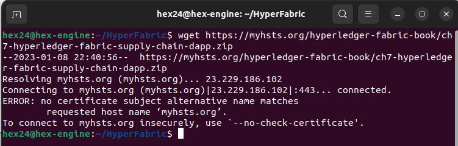

# Install Binaries and Docker Images #

Executing loadFabric.sh

Needed execute this also
```
chmod 777 ./loadFabric.sh
```

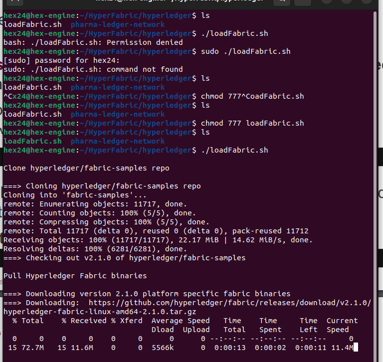

# Start the PLN Network #

Needed execute these also
```
chmod 777 ./net-pln.sh
```

Paleidziam net-pln.sh su up

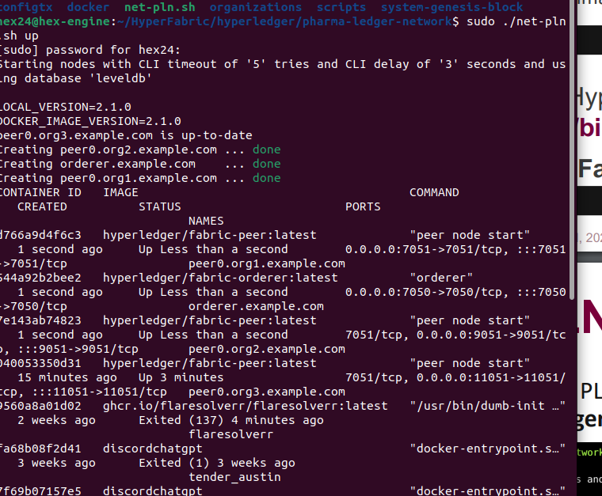

Running net-pln.sh su monitor

needed to run:

```
chmod 777 ./scripts/monitor.sh
chmod 777 ./scripts/createChannel.sh
chmod 777 ./scripts/deploySmartContract.sh
chmod 777 ./scripts/invokeContract.sh
chmod 777 ./scripts/utils.sh
```

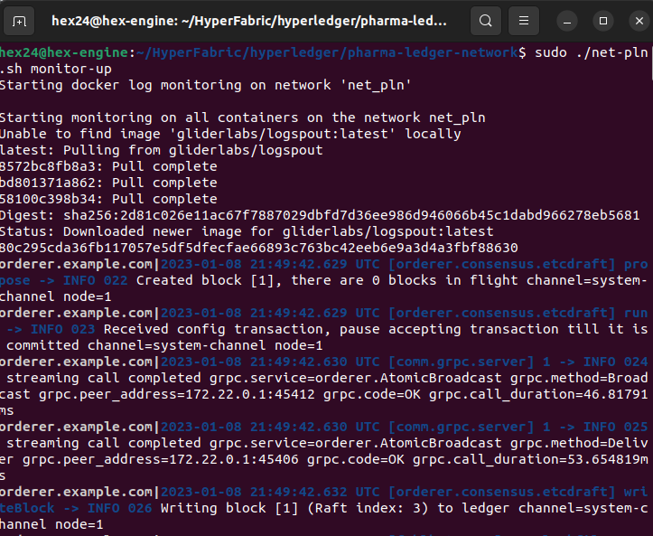

Running net-pln.sh with createChannel

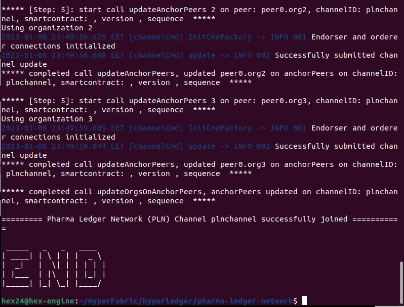

# Package and Install the Smart Contract #

Running npm install in contract

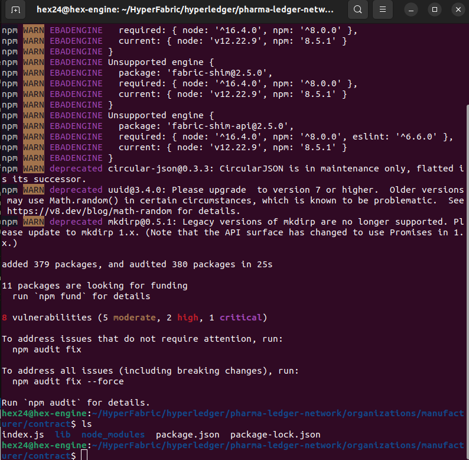

Deploying smart contract

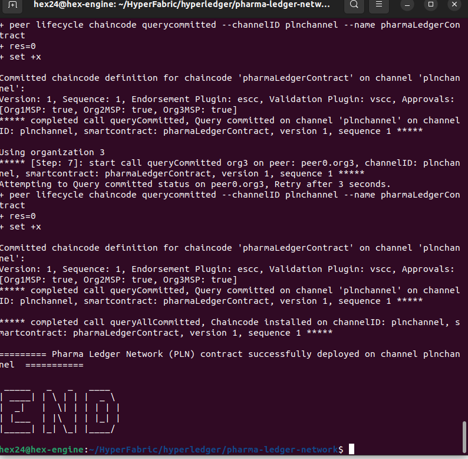

# Test the Smart Contract #

First contract testing command

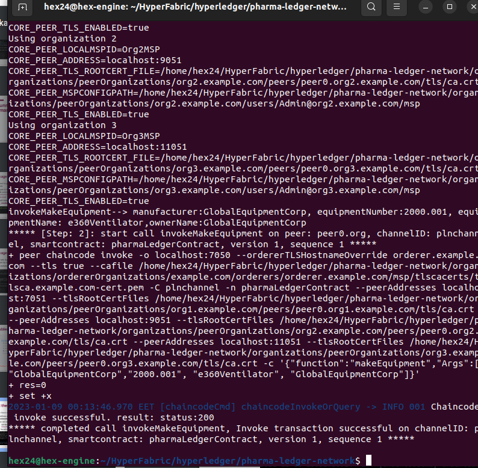

Invoking peer chaincode query command

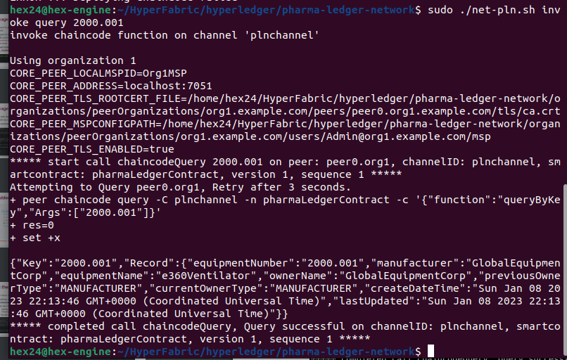

```
./net-pln.sh invoke wholesaler 2000.001 GlobalWholesalerCorp
```
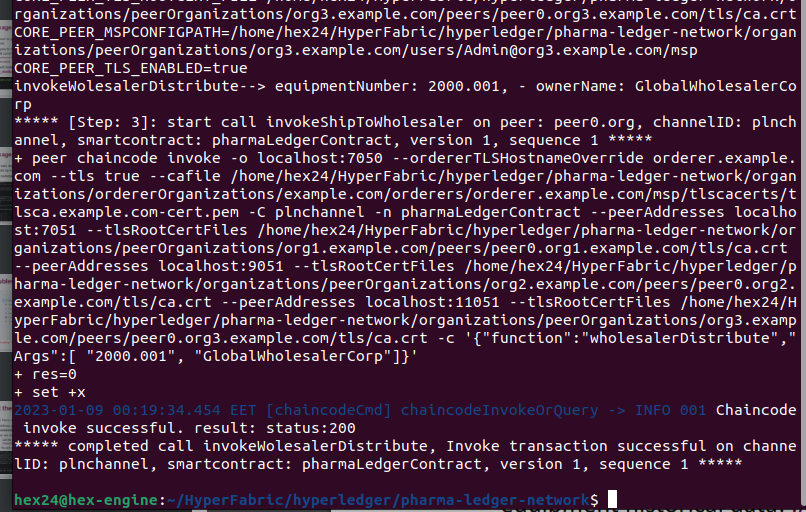

```
./net-pln.sh invoke pharmacy 2000.001 PharmacyCorp
```
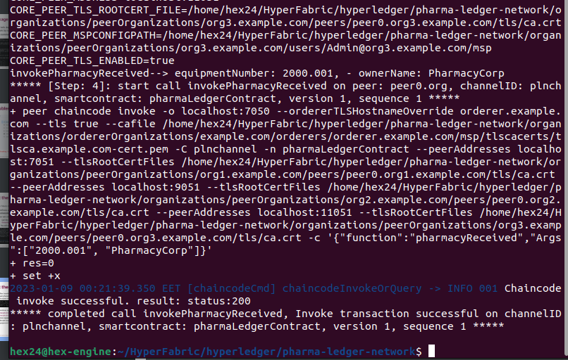

```
./net-pln.sh invoke queryHistory 2000.001
```

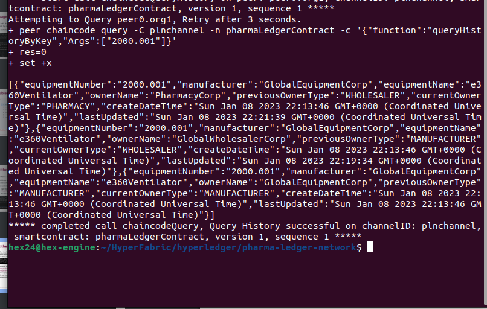

# Pharma-ledger client application #

Navigating to pharma-ledger-network/organizations/
manufacturer/application and then run

```
npm install
node app.js
```

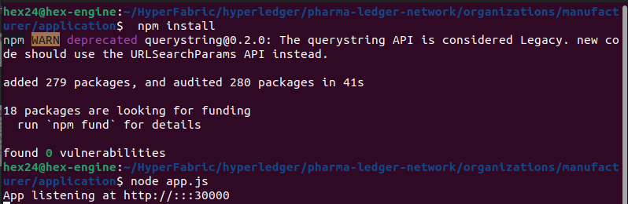

Creating first user "Markas"

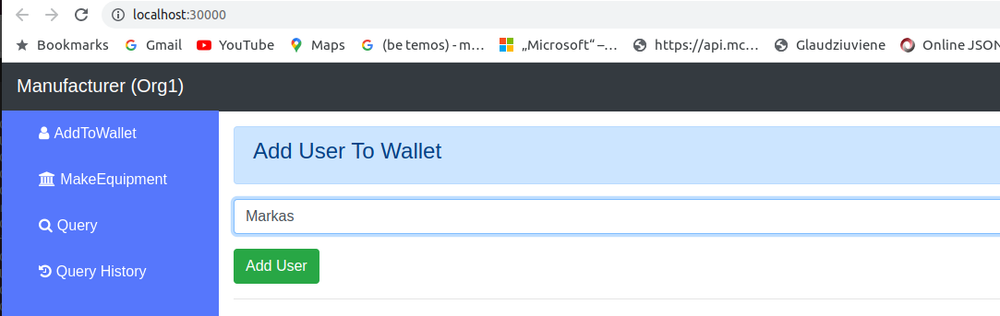

Facing unknown error, so skipping several steps

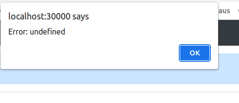

Installing using npm install / node run app wholesaler with error

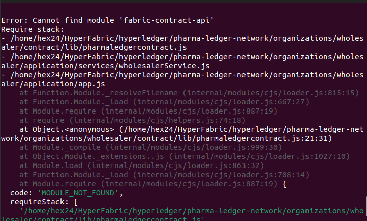

Installing using npm install / node run app pharmacy node server with error


Trying fix error by updating npm

```
sudo npm update -g
```
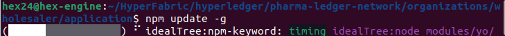

Error persists with:

```
fabric-contract-api not found
```

Trying fix error by manually installing api

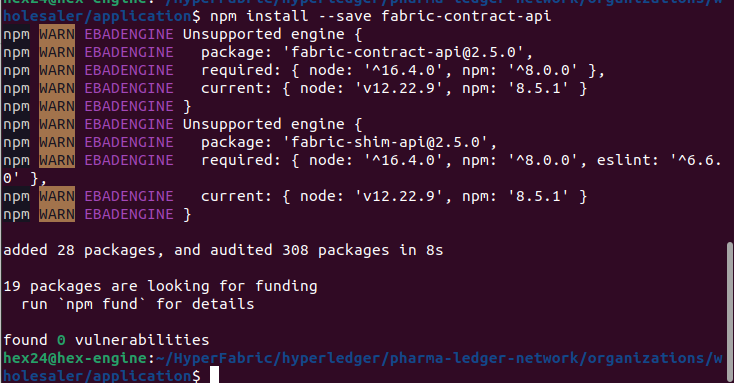

Error persists with:

```
fabric-contract-api not found
```


